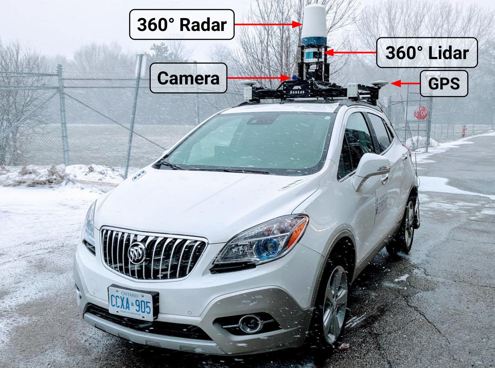
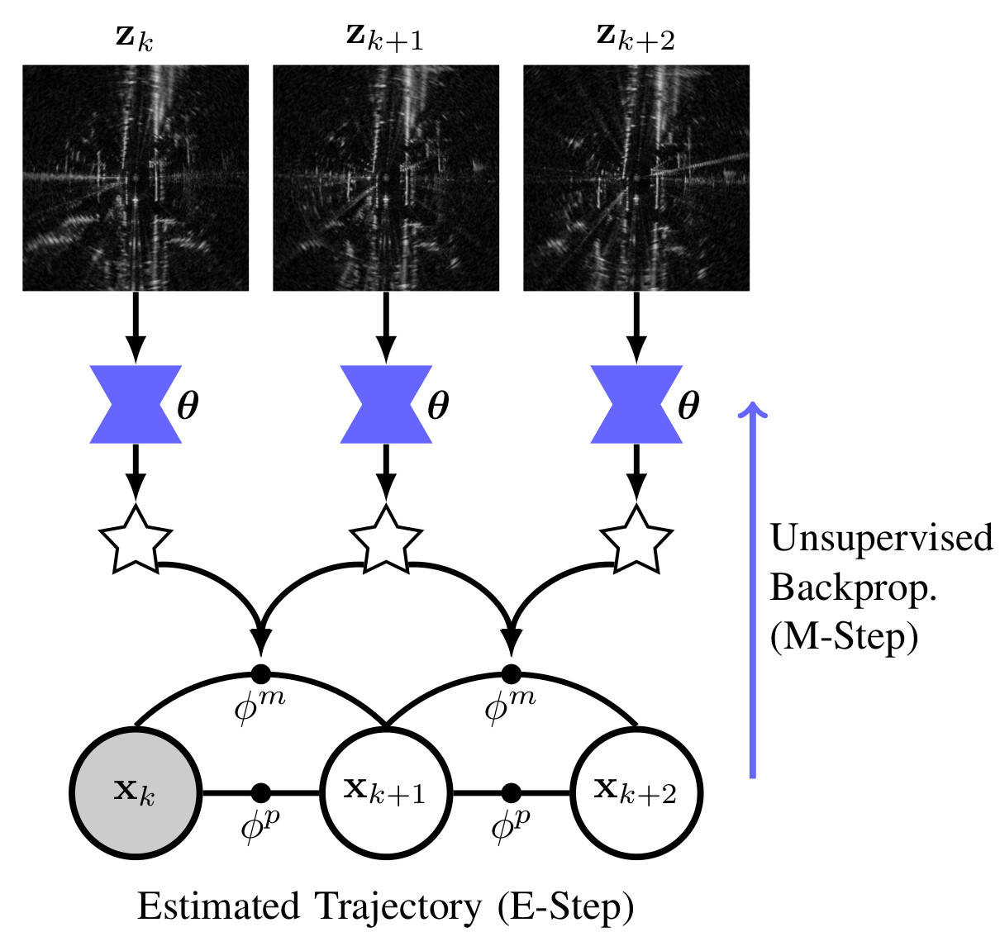
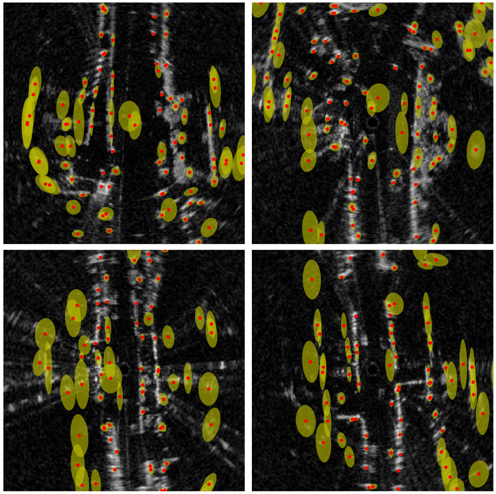
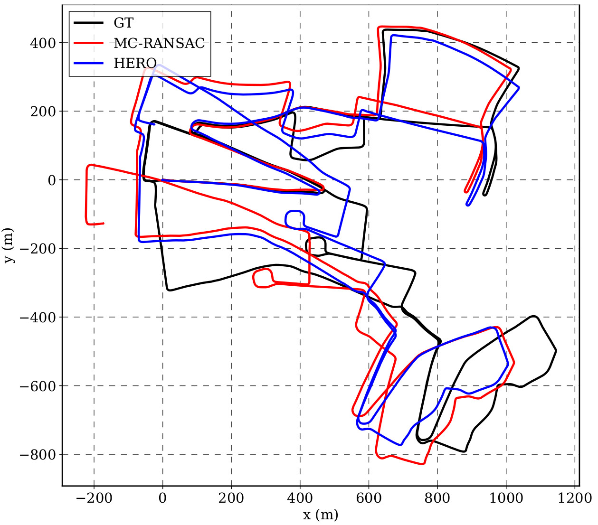

# HERO (Hybrid-Estimate Radar Odometry)
*Modified from https://github.com/utiasASRL/hero_radar_odometry.git*  
HERO (Hybrid-Estimate Radar Odometry) combines probabilistic state estimation and deep learned features. The network is trained in an unsupervised fashion. Deep learning is leveraged to process rich sensor data while classic state estimation is used to handle probabilities and out-of-distribution samples through outlier rejection schemes. To our knowledge, this is the first example of a totally unsupervised radar odometry pipeline. Our pipeline aproaches the performance of the current state of the art in point-based radar odometry, [Under the Radar](https://arxiv.org/abs/2001.10789), while being unsupervised.

## Updates

**(2021-12-14): [Boreas: A Multi-Season Autonomous Driving Dataset](https://boreas.utias.utoronto.ca): We have made our dataset publicly available along with a development kit, [pyboreas](https://github.com/utiasASRL/pyboreas), and public leaderboards for odometry, localization, and object detection.**

---

Our implementation uses PyTorch for the deep network, and C++/[STEAM](https://github.com/utiasASRL/steam) for the state estimation back-end. We use a sliding window of length 4 to obtain the best results. Note that we train using a fixed seed (0) in order to make our training results more reproducible.

This repository also provides an implementation of Dan Barnes' [Under the Radar](https://arxiv.org/abs/2001.10789).

We trained and tested these networks on the [Oxford Radar Robotcar Dataset](https://oxford-robotics-institute.github.io/radar-robotcar-dataset/). Results of our method compared against others is provided below. HC: Hand-crafted, L: Learned. In our paper, we also provide results on 100 km of data collected using our own platform, shown below. In addition, our paper provides results comparing the performance of radar odometry in sunny and snowy weather.

| Methods         | Supervision       | Translational Error (%) | Rotational Error (1 x 10<sup>-3</sup> deg/m) |
|-----------------|-------------------|-------------------------|:--------------------------------------------:|
| [Under the Radar](https://arxiv.org/abs/2001.10789) | Supervised (L)    | 2.0583                  | 6.7                                          |
| [RO Cen](https://www.robots.ox.ac.uk/~mobile/Papers/2018ICRA_cen.pdf)          | Unsupervised (HC) | 3.7168                  | 9.5                                          |
| [MC-RANSAC](https://arxiv.org/abs/2011.03512)       | Unsupervised (HC) | 3.3204                  | 10.95                                        |
| [HERO](https://arxiv.org/abs/2105.14152) (Ours)     | Unsupervised (L)  | 1.9879                  | 6.524                                        |

[Radar Odometry Combining Probabilistic Estimation and Unsupervised Feature Learning](https://arxiv.org/pdf/2105.14152.pdf) 

```
@INPROCEEDINGS{burnett_rss21,
    title={Radar Odometry Combining Probabilistic Estimation and Unsupervised Feature Learning},
    author={Burnett, Keenan and Yoon, David J and Schoellig, Angela P and Barfoot, Timothy D},
    booktitle={Robotics: Science and Systems},
    year={2021}
}
```

## Boreas Data-Taking Platform


## Pose-Graph Architecture


## DNN Architecture


## Keypoint Covariances


## Odometry Performance


# Build Instrucions
We provide a Dockerfile which can be used to build a docker image with all the required dependencies installed. It is possible to build and link all required dependencies using cmake, but we do not provide instrucions for this. To use NVIDIA GPUs within docker containers, you'll need to install [nvidia-docker](https://github.com/NVIDIA/nvidia-docker)

## Building Docker Image:
```
cd docker
docker build -t hero-image .
```
## Launching NVIDIA-Docker Container:
```
docker run --gpus all --rm -it \
    --name hero_docker \
    -v <path_to_dataset>:/workspace/<dataset_path>  # Change to loc of oxford data
    --shm-size 16G \
    --ipc=host -p 6006:80 \  # tensorboard within docker at port 80 to 6006 on host
    hero-image:latest
```
## Building CPP-STEAM:
After launching the docker container, clone repo and build C++ code:
```
git clone git@github.com:utiasASRL/hero_radar_odometry.git
cd hero_radar_odometry
mkdir cpp/build
cd cpp/build
cmake .. && make
```

# Getting Started
To train a new model, we provide `train.py`, which can be used as follows:

```
python3 train.py --pretrain <optional_pretrained_model_path> --config <config_file_path>
```

Note that we publish training results to [tensorboard](https://pytorch.org/docs/stable/tensorboard.html).
The tensorboard logs are saved to `data_dir`, as defined in the config file. Update this to your desired log folder.

As a convenience, we have provided pre-trained models and their associated config files which can be downloaded using `download_models.sh`. Among the pre-trained models are HERO (window size 2, 4) and UnderTheRadar (window size 2). Our implementation of UnderTheRadar achieves 3.08 % translation error and 10.7 deg/1000m rotation error.

To evaluate a trained model, use `eval.py` with the following format:

```
python3 eval.py --pretrain <pretrained_model_path> --config <config_file_path>
```

# Network Configuration
`model` : HERO or UnderTheRadar \
`data_dir` : set to the parent directory of the oxford dataset sequences \
`log_dir` : write tensorboard logs to this directory \
`cart_resolution` : meters per pixel in the cartesian radar input to the DNN \
`cart_pixel_width` : width of the cartesian radar input in pixels \
`train_split` : indices of the oxford sequence used for training \
`validation_split` : index of the oxford sequence used for validation \
`test_split` : indices of the oxford sequence used for testing \
`networks[unet][bilinear]` : true: use bilinear intep, false: use transposed conv (EXPERIMENTAL) \
`networks[unet][first_feature_dimension]` : depth of first CNN \
`networks[keypoint][patch_size]` : width of spatial softmax patches in pixels \
`networks[softmax][softmax_temp]` : softmax temp T = (1 / (this parameter)) \
`steam[weight_matrix]` : If `true` use a 2x2 weight matrix, if `false` use a scalar weight \
`steam[log_det_thres_flag]` : If true, treshold on log(det(W)) > param during eval \
`steam[log_det_thres_val]` : At test time, can be used to treshold on log(det(W)) > param \
`steam[log_det_topk]` : The minimum number of features that must be retained after filtering (use NMS) \
`steam[use_ransac]` : true: use RANSAC to find inlier set at test time, send inliers to STEAM \
`steam[ransac_version]` : 0: rigid RANSAC, 1: MC-RANSAC \
`steam[use_ctsteam]` : true: uses the approx timestamp of each measurement to do motion compensation \
`steam[ex_translation_vs_in_s]` : translation from sensor to vehicle as measured in sensor \
`steam[zero_vel_prior]` : zero velocity prior on dims outside of SE(2) \
`steam[vel_prior]` : use previously esimated velocity as an additional prior \
`lr` : learning rate \
`window_size` : size of the sliding window esimator in frames (2 = normal frame-to-frame) \
`augmentation[rot_max]` : Random rotation augmentation sampled from uniform[-rot_max, rot_max]

# TODO Items

- [ ] Train with batchsize > 2
